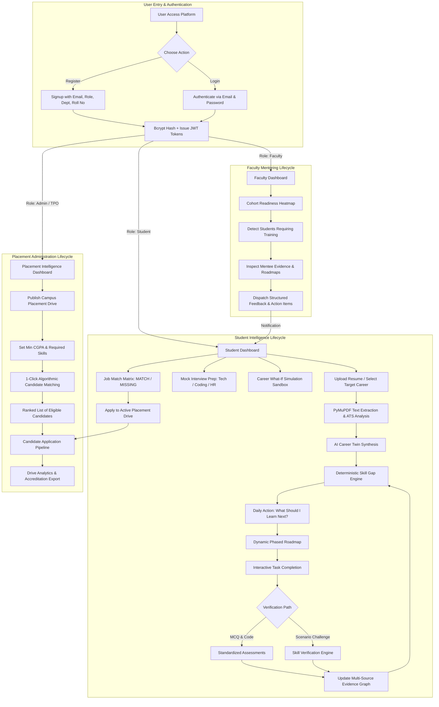
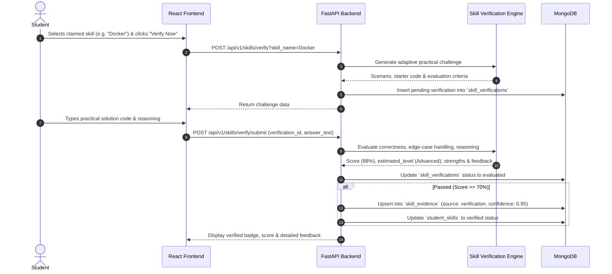

# SkillSync AI — Complete End-to-End Flow, Schema Design & Architectural Notes

> **Comprehensive Architectural Blueprint for SkillSync AI**  
> *College Career Intelligence & Placement Readiness Platform*  
> *Technology Stack: React 18 + Vite + Tailwind CSS • Python + FastAPI • MongoDB (Motor Async) • JWT RBAC • Multi-LLM API*

---

## Table of Contents
1. [Executive Overview & Core Principle](#1-executive-overview--core-principle)
2. [Complete End-to-End Application Flows](#2-complete-end-to-end-application-flows)
   - [2.1 Master System Workflow (Mermaid)](#21-master-system-workflow-mermaid)
   - [2.2 Student Onboarding & Career Twin Lifecycle](#22-student-onboarding--career-twin-lifecycle)
   - [2.3 Dynamic Roadmap & Continuous Recalculation Flow](#23-dynamic-roadmap--continuous-recalculation-flow)
   - [2.4 Resume ATS Analysis & Keyword Scoring Flow](#24-resume-ats-analysis--keyword-scoring-flow)
   - [2.5 Practical Skill Verification & Evidence Weighting Flow](#25-practical-skill-verification--evidence-weighting-flow)
   - [2.6 Faculty Mentoring & Intervention Flow](#26-faculty-mentoring--intervention-flow)
   - [2.7 TPO Placement Intelligence & 1-Click Candidate Matching Flow](#27-tpo-placement-intelligence--1-click-candidate-matching-flow)
   - [2.8 AI Orchestrator & Deterministic Pipeline](#28-ai-orchestrator--deterministic-pipeline)
3. [Complete MongoDB Database Schema Design](#3-complete-mongodb-database-schema-design)
   - [3.1 Multi-Tenant Core Schemas](#31-multi-tenant-core-schemas)
   - [3.2 Skill, Evidence & Career Schemas](#32-skill-evidence--career-schemas)
   - [3.3 Assessment & Verification Schemas](#33-assessment--verification-schemas)
   - [3.4 Resume & Job Matching Schemas](#34-resume--job-matching-schemas)
   - [3.5 Roadmap & Project Schemas](#35-roadmap--project-schemas)
   - [3.6 Interview & Placement Drive Schemas](#36-interview--placement-drive-schemas)
   - [3.7 System, Audit & Notification Schemas](#37-system-audit--notification-schemas)
   - [3.8 Recommended Indexes Matrix](#38-recommended-indexes-matrix)
4. [Application Architecture Notes & Best Practices](#4-application-architecture-notes--best-practices)
   - [4.1 Why Motor Async + MongoDB?](#41-why-motor-async--mongodb)
   - [4.2 Strict Deterministic Rules vs LLM Responsibilities](#42-strict-deterministic-rules-vs-llm-responsibilities)
   - [4.3 Multi-Tenant Isolation & JWT Security Context](#43-multi-tenant-isolation--jwt-security-context)
   - [4.4 Evidence Confidence Formula & Weighting Engine](#44-evidence-confidence-formula--weighting-engine)
   - [4.5 Production Deployment & Operational Runbook](#45-production-deployment--operational-runbook)

---

## 1. Executive Overview & Core Principle

SkillSync AI operates on the fundamental 4-stage feedback loop:

$$\text{Where am I now?} \longrightarrow \text{Where do I want to go?} \longrightarrow \text{What am I missing?} \longrightarrow \text{What should I do next?}$$

```
+-------------------------------------------------------------------------------------------------------+
|                                           SKILLSYNC AI                                                |
|                                                                                                       |
|    +-------------------+           +-----------------------+           +-------------------------+    |
|    |  STUDENT PORTAL   |           |    FACULTY PORTAL     |           |    ADMIN / TPO PORTAL   |    |
|    |                   |           |                       |           |                         |    |
|    | • Profile Setup   |           | • Assigned Mentees    |           | • Placement Intel       |    |
|    | • Career Twin     |           | • Cohort Monitor      |           | • Drive Scheduling      |    |
|    | • Dynamic Roadmap | <=======> | • Assessment Rates    | <=======> | • 1-Click Candidate Match|   |
|    | • ATS Resume Suite|           | • At-Risk Alerts      |           | • Company Directory     |    |
|    | • Skill Challenges|           | • Mentoring Feedback  |           | • User Management       |    |
|    | • Mock Interviews |           | • Student Reports     |           | • Accreditation Reports |    |
|    | • Career What-If  |           |                       |           | • AI Config & Audit Logs|    |
|    +-------------------+           +-----------------------+           +-------------------------+    |
+-------------------------------------------------------------------------------------------------------+
```

---

## 2. Complete End-to-End Application Flows

### 2.1 Master System Workflow (Mermaid)



---

### 2.2 Student Onboarding & Career Twin Lifecycle

```
[1. Student Signup]
       │  (Email, Password, Department, Roll No, Grad Year)
       ▼
[2. Baseline Career Goal Selection]
       │  (e.g., Full Stack Developer, AI Engineer, Cloud DevOps)
       ▼
[3. Resume Ingestion or Interactive Builder]
       │  (PDF / DOCX parsed via PyMuPDF; ATS keywords & scores extracted)
       ▼
[4. Initial Assessment]
       │  (Standardized timed technical questions scored deterministically)
       ▼
[5. Multi-Source Evidence Graph Formulation]
       │  • Self-Reported Skills (Weight: 0.30)
       │  • Resume Extracted Skills (Weight: 0.60)
       │  • Student Projects (Weight: 0.75)
       │  • Standardized Assessments (Weight: 0.85)
       │  • Practical Challenge Verification (Weight: 0.95)
       ▼
[6. AI Career Twin Dashboard Synthesis]
       │  • Career Twin Completeness Score (%)
       │  • Readiness vs Gap (%)
       │  • ATS Alignment Score (%)
       ▼
[7. "What Should I Learn Next?" Callout Card]
       │  Singular prioritized learning milestone with 1-click CTA
```

---

### 2.3 Dynamic Roadmap & Continuous Recalculation Flow

```
[Target Career Requirements] + [Current Demonstrated Evidence Graph]
                               │
                               ▼
               [Prerequisite Dependency Tree Analysis]
                               │
                               ▼
            [Phased Dynamic Roadmap Generation (v1)]
             ├── Phase 1: Foundations & High-Priority Gap Closures
             ├── Phase 2: System Integration & Capstone Portfolio
             └── Phase 3: Placement Sprints & Mock Interview Readiness
                               │
                               ▼
             [Student Clicks Task to Change Status]
                      (todo ➔ in_progress ➔ completed)
                               │
                               ▼
            [Backend Records New Completed Evidence]
                               │
                               ▼
           [Dynamic Skill-Gap Recalculation Triggered]
                               │
                               ▼
            [New Roadmap Version (v2) Generated & Persisted]
```

---

### 2.4 Resume ATS Analysis & Keyword Scoring Flow

1. **Upload Phase**: Student uploads `.pdf` or `.docx` file via `POST /api/v1/resumes/upload`.
2. **Text Extraction**: PyMuPDF (`pymupdf`) extracts raw textual content, cleans excess whitespace, and handles multi-column layouts.
3. **Keyword & Metric Analysis**:
   - Compares detected technical keywords against target career benchmark requirements.
   - Evaluates action verbs, quantifiable XYZ-formula impact statements (e.g., *"improved throughput by 24%"*), and structural layout.
4. **Scoring & Section Critique**:
   - Calculates **Overall ATS Score (0–100%)**, **Keywords Score**, **Format Score**, and **Impact Score**.
   - Generates section-by-section recommendations: `section`, `issue`, `suggested_improvement`, `reason`.
5. **Persistence**: Saves resume document to `resumes` and analysis results to `resume_analyses` for instant recall.

---

### 2.5 Practical Skill Verification & Evidence Weighting Flow



---

### 2.6 Faculty Mentoring & Intervention Flow

1. **Cohort Monitoring**: Faculty coordinator logs in and accesses `/faculty/dashboard`.
2. **Readiness Telemetry**: Real-time aggregation calculates:
   - Cohort size
   - Assessment completion rate
   - Average verified skill evidence per mentee
   - Students flagged with `training_flag: true` (CGPA < 7.0 or evidence count < 2).
3. **Student Profile Inspection**: Faculty inspects mentee's evidence graph, completed roadmap tasks, and assessment scores.
4. **Feedback Dispatch**: Faculty inputs mentoring evaluation notes and structured action items via `POST /api/v1/faculty/students/{id}/feedback`.
5. **Notification Delivery**: Saved to `notifications` collection and automatically surfaced on the student's dashboard.

---

### 2.7 TPO Placement Intelligence & 1-Click Candidate Matching Flow

```mermaid
flowchart LR
    A[TPO Logs In] --> B[Placement Intelligence Dashboard]
    B --> C[Create Campus Placement Drive]
    C --> D["Define Eligibility:<br/>• Min CGPA: 7.5<br/>• Depts: CSE, IT<br/>• Skills: Python, FastAPI, Docker"]
    D --> E[Click 'Match Eligible Students']
    E --> F[(MongoDB Aggregation Pipeline)]
    F --> G["Match Candidates:<br/>1. Filter CGPA >= 7.5<br/>2. Intersect Required Skills with Verified Evidence<br/>3. Compute Skill Match %"]
    G --> H[Ranked Eligible Candidate Table]
    H --> I[Students Submit Direct Applications]
    I --> J[TPO Exports Shortlist for Recruiter]
```



---

### 2.8 AI Orchestrator & Deterministic Pipeline

```
  React 18 Frontend
         │
         ▼
  FastAPI REST API Layer  ───> [JWT Authentication & Tenant College Resolution]
         │
         ▼
  Service Layer
         │
         ▼
  AI Orchestrator (orchestrator.py)
         ├── Step 1: Check Anthropic Claude 3.5 Sonnet API
         ├── Step 2: Fallback to Local Ollama Server (http://localhost:11434)
         └── Step 3: Fallback to Deterministic Offline Knowledge Engine
         │
         ▼
  Pydantic Output Validation (Strict Schema Enforcement)
         │
         ▼
  Business Logic & Evidence Weighting Engine (skill_engine.py)
         │  (Deterministic score calculations, confidence weights, permissions)
         ▼
  Motor Async MongoDB Persistence (skillsync_ai database)
         │
         ▼
  Dashboard Real-Time Response
```

---

## 3. Complete MongoDB Database Schema Design

### 3.1 Multi-Tenant Core Schemas

#### Collection: `colleges`
Stores institutional profile, branding, and global settings.
```json
{
  "_id": "ObjectId",
  "college_id_str": "col_apex_001",
  "name": "Apex Institute of Technology",
  "code": "APEX-ENG",
  "logo_url": "/assets/branding/apex_logo.png",
  "branding": {
    "primary_color": "#7c3aed",
    "accent_color": "#10b981",
    "tagline": "Excellence in Engineering & Career Intelligence"
  },
  "settings": {
    "allow_student_signup": true,
    "require_roll_number": true,
    "default_min_cgpa": 6.0
  },
  "status": "active",
  "created_at": "2026-09-18T15:00:00Z"
}
```

#### Collection: `departments`
Academic departments within each college.
```json
{
  "_id": "ObjectId",
  "college_id": "col_apex_001",
  "name": "Computer Science & Engineering",
  "code": "CSE",
  "head_of_department": "Dr. Sarah Jenkins",
  "status": "active"
}
```

#### Collection: `users`
Authentication credentials, role, and tenant linkage.
```json
{
  "_id": "ObjectId",
  "college_id": "col_apex_001",
  "name": "Alex Morgan",
  "email": "student@skillsync.ai",
  "password_hash": "$2b$12$e8Y7x...",
  "role": "student", // "student" | "faculty" | "admin"
  "status": "active",
  "last_login": "2026-09-18T15:30:00Z",
  "created_at": "2026-09-18T15:00:00Z"
}
```

#### Collection: `students`
Student profile, academic records, and career targets.
```json
{
  "_id": "ObjectId",
  "user_id": "6aad56f8f70156c95333f1f5",
  "college_id": "col_apex_001",
  "department_id": "dept_cse_001",
  "department_name": "Computer Science & Engineering",
  "roll_number": "CS2026-042",
  "academic_year": "Final Year",
  "graduation_year": 2026,
  "cgpa": 8.7,
  "target_career_id": "6aad56f8f70156c95333f1f8",
  "target_career_name": "Full Stack Developer",
  "bio": "Passionate aspiring full-stack engineer focused on Python, FastAPI, and React."
}
```

#### Collection: `faculty`
Faculty mentor assignment and designation records.
```json
{
  "_id": "ObjectId",
  "user_id": "6aad56f8f70156c95333f1f6",
  "college_id": "col_apex_001",
  "department_id": "dept_cse_001",
  "employee_code": "FAC-CSE-108",
  "designation": "Associate Professor & Placement Coordinator"
}
```

---

### 3.2 Skill, Evidence & Career Schemas

#### Collection: `skills`
Master repository of technical and domain competencies.
```json
{
  "_id": "ObjectId",
  "name": "Docker",
  "category": "DevOps & Cloud",
  "description": "Containerization platform for building and shipping distributed microservices.",
  "aliases": ["Docker Compose", "Containers", "Docker Engine"],
  "status": "active"
}
```

#### Collection: `student_skills`
Student-claimed skills and proficiency levels.
```json
{
  "_id": "ObjectId",
  "student_id": "6aad56f8f70156c95333f1f5",
  "skill_id": "Docker",
  "name": "Docker",
  "current_level": "Intermediate", // "Beginner" | "Intermediate" | "Advanced"
  "self_rating": 4,
  "status": "verified" // "active" | "verified"
}
```

#### Collection: `skill_evidence`
Multi-source confidence evidence backing student skills.
```json
{
  "_id": "ObjectId",
  "student_id": "6aad56f8f70156c95333f1f5",
  "skill_id": "Docker",
  "skill_name": "Docker",
  "source_type": "verification", // "self_report" | "resume" | "project" | "assessment" | "verification"
  "source_id": "verif_doc_123",
  "confidence": 0.95,
  "evidence": "Scored 88% on practical Docker container orchestration test",
  "updated_at": "2026-09-18T15:20:00Z"
}
```

#### Collection: `careers`
Target career profiles with benchmark skill requirements.
```json
{
  "_id": "ObjectId",
  "name": "Full Stack Developer",
  "description": "Designs and engineers responsive web frontends, resilient RESTful microservices, and databases.",
  "experience_level": "Entry to Mid Level",
  "skill_requirements": [
    { "name": "Python", "level": "Advanced", "priority": "High" },
    { "name": "FastAPI", "level": "Intermediate", "priority": "High" },
    { "name": "React", "level": "Advanced", "priority": "High" },
    { "name": "MongoDB", "level": "Intermediate", "priority": "High" },
    { "name": "Docker", "level": "Intermediate", "priority": "High" },
    { "name": "AWS Cloud", "level": "Beginner", "priority": "Medium" }
  ]
}
```

---

### 3.3 Assessment & Verification Schemas

#### Collection: `assessments`
Standardized technical assessment tests.
```json
{
  "_id": "ObjectId",
  "title": "Full Stack Python & API Engineering Assessment",
  "career_id": "6aad56f8f70156c95333f1f8",
  "duration_minutes": 25,
  "difficulty": "Intermediate",
  "total_questions": 5,
  "questions": [
    {
      "id": "q1",
      "question": "In FastAPI, which dependency mechanism injects database sessions?",
      "options": ["Depends(get_db)", "Middleware context global", "Threading local", "Static class"],
      "correct_index": 0,
      "explanation": "Depends(get_db) leverages Python async generators for automatic cleanup."
    }
  ]
}
```

#### Collection: `assessment_attempts`
Records of student assessment test sessions and scores.
```json
{
  "_id": "ObjectId",
  "student_id": "6aad56f8f70156c95333f1f5",
  "assessment_id": "assess_123",
  "assessment_title": "Full Stack Python & API Engineering Assessment",
  "score": 80,
  "passed": true,
  "status": "completed",
  "started_at": "2026-09-18T15:10:00Z",
  "submitted_at": "2026-09-18T15:25:00Z"
}
```

#### Collection: `skill_verifications`
Adaptive practical challenges generated per Section 16.
```json
{
  "_id": "ObjectId",
  "student_id": "6aad56f8f70156c95333f1f5",
  "skill_name": "Docker",
  "level": "Intermediate",
  "challenge": {
    "title": "Docker Practical Engineering Challenge",
    "scenario": "A containerized service experiences intermittent timeouts. Write Dockerfile multi-stage build optimizations...",
    "sample_starter_code": "FROM python:3.11-slim\n...",
    "evaluation_criteria": ["Build efficiency", "Security posture", "Cleanliness"]
  },
  "student_submission": "FROM python:3.11-slim as builder\n...",
  "status": "evaluated",
  "score": 88,
  "passed": true,
  "evaluation": {
    "estimated_level": "Advanced",
    "score": 88,
    "strengths": ["Multi-stage build eliminates build tools", "Non-root user configured"],
    "weaknesses": ["Healthcheck interval could be calibrated"]
  },
  "completed_at": "2026-09-18T15:35:00Z"
}
```

---

### 3.4 Resume & Job Matching Schemas

#### Collection: `resumes`
Uploaded and built resume records.
```json
{
  "_id": "ObjectId",
  "student_id": "6aad56f8f70156c95333f1f5",
  "title": "Alex_Morgan_Resume_2026.pdf",
  "file_url": "/uploads/6aad56..._Alex_Morgan_Resume_2026.pdf",
  "raw_text": "Alex Morgan | alex.morgan@skillsync.ai | Python, FastAPI, React...",
  "status": "uploaded",
  "created_at": "2026-09-18T15:15:00Z"
}
```

#### Collection: `resume_analyses`
Section 12 ATS keyword critique and improvement recommendations.
```json
{
  "_id": "ObjectId",
  "resume_id": "resume_123",
  "student_id": "6aad56f8f70156c95333f1f5",
  "career_name": "Full Stack Developer",
  "analysis": {
    "ats_score": 84,
    "summary_score": 80,
    "skills_score": 85,
    "impact_score": 75,
    "detected_skills": ["Python", "FastAPI", "React", "MongoDB"],
    "missing_skills": ["Docker", "Kubernetes", "AWS Cloud"],
    "recommendations": [
      {
        "section": "Projects & Experience",
        "issue": "Action verbs lack quantifiable metrics and scale.",
        "suggested_improvement": "Use XYZ formula: Accomplished [X], as measured by [Y], by doing [Z].",
        "reason": "Top employers and automated ATS score measurable impact 3x higher."
      }
    ]
  },
  "created_at": "2026-09-18T15:16:00Z"
}
```

#### Collection: `jobs`
Active campus recruitment job postings.
```json
{
  "_id": "ObjectId",
  "college_id": "col_apex_001",
  "company_name": "Google Cloud",
  "title": "Associate Cloud & Backend Engineer",
  "description": "Design distributed microservices with Python, FastAPI, and Docker.",
  "experience": "0-1 years (Fresher)",
  "salary_package": "18.5 LPA",
  "location": "Bangalore / Hyderabad",
  "eligibility_min_cgpa": 8.0,
  "required_skills": ["Python", "FastAPI", "Docker", "System Design"],
  "preferred_skills": ["Kubernetes", "MongoDB"],
  "status": "active"
}
```

#### Collection: `job_matches`
Section 13 requirement matrix comparing job to candidate evidence.
```json
{
  "_id": "ObjectId",
  "student_id": "6aad56f8f70156c95333f1f5",
  "job_id": "job_123",
  "match_score": 75,
  "analysis": {
    "job_title": "Associate Cloud & Backend Engineer",
    "overall_match_score": 75,
    "eligibility_status": "Eligible",
    "requirements_analysis": [
      { "requirement": "Python", "status": "MATCH", "category": "Language" },
      { "requirement": "FastAPI", "status": "MATCH", "category": "Framework" },
      { "requirement": "Docker", "status": "PARTIAL_MATCH", "category": "DevOps" },
      { "requirement": "System Design", "status": "MISSING", "category": "Architecture" }
    ]
  }
}
```

---

### 3.5 Roadmap & Project Schemas

#### Collection: `roadmaps`
Section 8 dynamic phased learning path and task states.
```json
{
  "_id": "ObjectId",
  "student_id": "6aad56f8f70156c95333f1f5",
  "career_id": "6aad56f8f70156c95333f1f8",
  "career_name": "Full Stack Developer",
  "version": 1,
  "phases": [
    {
      "phase": 1,
      "title": "Foundations & Critical Skill Closures",
      "focus": "Close high-priority missing skills for placement eligibility",
      "tasks": [
        {
          "id": "t1",
          "skill": "Docker",
          "task": "Core Mastery & Hands-on Lab: Docker",
          "reason": "Top prerequisite evaluated in initial technical screening rounds.",
          "priority": "HIGH",
          "difficulty": "Intermediate",
          "estimated_effort": "12 hours",
          "prerequisites": ["Python Basics"],
          "expected_outcome": "Build and run multi-container microservices.",
          "verification_method": "Practical Verification Challenge",
          "status": "completed"
        }
      ]
    }
  ],
  "status": "active",
  "generated_at": "2026-09-18T15:05:00Z"
}
```

#### Collection: `student_projects`
Candidate capstone and microservice portfolio projects.
```json
{
  "_id": "ObjectId",
  "student_id": "6aad56f8f70156c95333f1f5",
  "title": "College Placement Automation Service",
  "description": "A microservices application built with FastAPI and MongoDB to track company registration and eligibility.",
  "technologies": ["Python", "FastAPI", "MongoDB"],
  "repository_url": "https://github.com/alexmorgan/college-placement-api",
  "progress": 100,
  "status": "completed"
}
```

---

### 3.6 Interview & Placement Drive Schemas

#### Collection: `placement_drives`
Institutional recruitment drive configuration.
```json
{
  "_id": "ObjectId",
  "college_id": "col_apex_001",
  "company_name": "Google Cloud",
  "job_title": "Associate Cloud & Backend Engineer",
  "job_id": "job_123",
  "salary_package": "18.5 LPA",
  "drive_date": "2026-10-15",
  "location": "Campus Auditorium & Virtual Assessment",
  "min_cgpa": 8.0,
  "eligible_departments": ["CSE", "IT"],
  "required_skills": ["Python", "FastAPI", "Docker"],
  "status": "active",
  "created_at": "2026-09-18T15:00:00Z"
}
```

#### Collection: `student_applications`
Student applications submitted to campus placement drives.
```json
{
  "_id": "ObjectId",
  "student_id": "6aad56f8f70156c95333f1f5",
  "student_name": "Alex Morgan",
  "drive_id": "drive_123",
  "company_name": "Google Cloud",
  "job_title": "Associate Cloud & Backend Engineer",
  "resume_id": "resume_123",
  "cover_note": "Applying directly via SkillSync AI Matching Engine",
  "status": "applied",
  "applied_at": "2026-09-18T15:20:00Z"
}
```

#### Collection: `interviews` & `interview_attempts`
AI mock interview question sets and candidate evaluations.
```json
{
  "_id": "ObjectId",
  "student_id": "6aad56f8f70156c95333f1f5",
  "interview_id": "iv_123",
  "question_id": "q1",
  "question": "Explain how you handle race conditions during high-volume API requests.",
  "answer": "I implement optimistic concurrency with version fields in MongoDB, or distributed Redis locks...",
  "score": 85,
  "feedback": {
    "strengths": ["Clearly explains distributed locking mechanisms", "Considers latency trade-offs"],
    "areas_for_improvement": ["Could mention retry backoff strategies"]
  },
  "submitted_at": "2026-09-18T15:30:00Z"
}
```

---

### 3.7 System, Audit & Notification Schemas

#### Collection: `notifications`
Targeted alerts dispatched to users (e.g. Faculty mentoring notes, drive updates).
```json
{
  "_id": "ObjectId",
  "user_id": "6aad56f8f70156c95333f1f5",
  "from_faculty_name": "Dr. Sarah Jenkins",
  "type": "faculty_feedback",
  "title": "Mentor Feedback from Faculty",
  "message": "Alex has demonstrated solid FastAPI fundamentals. Recommended to complete the Docker challenge before Oct 15.",
  "action_items": [
    "Complete Docker Microservices module",
    "Submit practical verification challenge"
  ],
  "read_at": null,
  "created_at": "2026-09-18T15:25:00Z"
}
```

#### Collection: `audit_logs`
Immutable compliance log for sensitive administrative actions.
```json
{
  "_id": "ObjectId",
  "college_id": "col_apex_001",
  "user_id": "admin_user_id",
  "action": "CREATE_PLACEMENT_DRIVE",
  "resource": "placement_drives",
  "resource_id": "drive_123",
  "metadata": { "company": "Google Cloud", "min_cgpa": 8.0 },
  "created_at": "2026-09-18T15:00:00Z"
}
```

---

### 3.8 Recommended Indexes Matrix

| Collection | Index Specification | Type | Optimization Target |
|---|---|---|---|
| `users` | `{ email: 1 }` | **UNIQUE** | Fast authentication lookups |
| `students` | `{ user_id: 1 }` | **UNIQUE** | Student profile resolution |
| `students` | `{ college_id: 1, department_id: 1 }` | Compound | Department cohort filtering |
| `student_skills`| `{ student_id: 1, skill_id: 1 }` | **UNIQUE** | Prevents duplicate skill entries |
| `skill_evidence`| `{ student_id: 1, skill_id: 1 }` | Compound | Fast confidence aggregation |
| `careers` | `{ name: 1 }` | Single | Career benchmark search |
| `career_goals` | `{ student_id: 1, active: 1 }` | Compound | Current active career resolution |
| `assessments` | `{ career_id: 1, skill_id: 1 }` | Compound | Test catalog filtering |
| `assessment_attempts` | `{ student_id: 1, assessment_id: 1 }` | Compound | Candidate attempt retrieval |
| `resumes` | `{ student_id: 1, created_at: -1 }` | Compound | Recent resume chronological order |
| `jobs` | `{ college_id: 1, status: 1 }` | Compound | Active campus job queries |
| `job_matches` | `{ student_id: 1, job_id: 1 }` | **UNIQUE** | Caches candidate match scores |
| `skill_gaps` | `{ student_id: 1, priority: 1 }` | Compound | Prioritized learning task resolution |
| `roadmaps` | `{ student_id: 1, version: -1 }` | Compound | Fetches latest roadmap version |
| `roadmap_tasks`| `{ roadmap_id: 1, status: 1 }` | Compound | Task progress status filtering |
| `placement_drives` | `{ college_id: 1, status: 1 }` | Compound | Active placement drives listing |
| `audit_logs` | `{ college_id: 1, created_at: -1 }` | Compound | Chronological security audit retrieval |

---

## 4. Application Architecture Notes & Best Practices

### 4.1 Why Motor Async + MongoDB?
1. **Dynamic Career Profiles**: Student resumes, skills, roadmaps, and AI analyses are hierarchical, evolving documents that do not conform to rigid tabular schemas without dozens of foreign-key joins.
2. **Asynchronous Throughput**: Using Python's `motor.motor_asyncio` non-blocking driver allows FastAPI's asyncio event loop to handle concurrent requests without thread-pool exhaustion.
3. **Embedded Snapshots**: AI analysis results and roadmap phases are embedded directly within parent records, allowing instantaneous single-query page loads.

### 4.2 Strict Deterministic Rules vs LLM Responsibilities
- **Rule**: *The LLM must never make mathematical calculations, evaluate permissions, or access MongoDB directly.*
- **Division of Labor**:
  - **Deterministic Application Layer**: Score aggregations, eligibility threshold checks (`cgpa >= drive.min_cgpa`), confidence score weighting, and role-based permissions remain in Python business logic.
  - **LLM Agent Layer**: Context analysis, ATS suggestions, scenario generation, structured JSON formatting, and feedback synthesis.

### 4.3 Multi-Tenant Isolation & JWT Security Context
- **Zero Client Trust**: The authenticated user's `college_id` is cryptographically extracted from the validated JWT token signature in `get_current_user`.
- **Query Scoping**: All institutional endpoints strictly enforce `{"college_id": college_id}` filters, preventing horizontal privilege escalation between universities sharing the platform.

### 4.4 Evidence Confidence Formula & Weighting Engine
SkillSync AI computes overall competency confidence using a multi-source weighted formula:

$$\text{Confidence}(S) = \max \left( \sum_{i} W_i \times E_i \right)$$

| Evidence Source ($i$) | Weight ($W_i$) | Validation Criteria |
|---|---|---|
| **Self-Reported Skill** | `0.30` | Candidate self-assessment rating (1–5) |
| **Resume Extraction** | `0.60` | Keyword detected in uploaded PDF/DOCX |
| **Portfolio Project** | `0.75` | Verified GitHub repository link with description |
| **Standardized Assessment** | `0.85` | Timed MCQ test score $\ge 60\%$ |
| **Practical Verification Challenge** | `0.95` | Scenario implementation evaluated by AI $\ge 70\%$ |

### 4.5 Production Deployment & Operational Runbook

```bash
# 1. Clone & Enter Directory
cd d:/Projects/skillsync-ai

# 2. Configure Environment Secrets
cp backend/.env.example backend/.env
# Update SECRET_KEY, MONGODB_URL, ANTHROPIC_API_KEY

# 3. Start Backend Services
python -m uvicorn backend.app.main:app --host 0.0.0.0 --port 8000 --workers 4

# 4. Build Frontend for Production
cd frontend
npm.cmd run build
# Serve dist/ via NGINX or static web server
```
